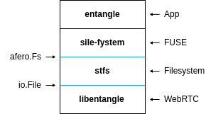

# entangle

A distributed peer-to-peer filesystem.

[](https://pkg.go.dev/github.com/alphahorizonio/entangle)

## Overview

`entangle` is a file-sharing and storing solution built on top of [`stfs`](https://github.com/pojntfx/stfs), [`sile-fystem`](https://github.com/JakWai01/sile-fystem) and [`libentangle`](https://github.com/alphahorizonio/libentangle).

## Reference 

```shell
A CLI to serve or mount a filesystem.
        For more information, please visit https://github.com/alphahorizonio/entangle

Usage:
  entangle [command]

Available Commands:
  client      Start entangle client instance
  completion  Generate the autocompletion script for the specified shell
  help        Help about any command
  mount       Mount a backend locally
  server      Start entangle server instance

Flags:
  -c, --community string    Community to join 
  -h, --help                help for entangle
  -m, --metadata string     Metadata database to use 
  -p, --mountpoint string   Mountpoint to use for FUSE 
  -s, --signal string       Address of signaling service 
  -v, --verbose int         Verbosity level

Use "entangle [command] --help" for more information about a command.
```

## Components 



### sile-fystem

`sile-fystem` is a generic FUSE implementation built on top of the `afero` API. Every filesystem supporting the `afero` API can therefore be used as a backend for this FUSE implementation.

A comprehensive reference of FUSE functions can be found [here](https://libfuse.github.io/doxygen/structfuse__operations.html#a1465eb2268cec2bb5ed11cb09bbda42f).

### STFS 

The Simple Tape File System (`STFS`) is a filesystem for tapes and tar files.

`STFS` implements and therefore exposes the `afero` API.

`STFS` supports proven compression, signature and encryption methods such as `GZip`, `Zstandard` and `PGP`.

### libentangle

`libentangle` is a package containing a webrtc signaling server, client and an implementation build upon that to handle files via P2P connection from remote using an extended `io.ReadWriteSeeker`. 

`libentangle` implements and therefore exposes the generic Go file interface. 

`libentangle` supports generic WebRTC dataChannel applications by injecting custom callbacks. 

## APIs

### Afero.Fs 

`Afero` provides the following filesystem functions, which are used by `sile-fystem` and exposed by `STFS`:

```Go
Chmod(name string, mode os.FileMode) : error
Chown(name string, uid, gid int) : error
Chtimes(name string, atime time.Time, mtime time.Time) : error
Create(name string) : File, error
Mkdir(name string, perm os.FileMode) : error
MkdirAll(path string, perm os.FileMode) : error
Name() : string
Open(name string) : File, error
OpenFile(name string, flag int, perm os.FileMode) : File, error
Remove(name string) : error
RemoveAll(path string) : error
Rename(oldname, newname string) : error
Stat(name string) : os.FileInfo, error
```

### File 

`libentangle` exposes an `io.ReadWriteSeeker`: 

```Go
Read(n []byte) (int, error) 
Write(n []byte) (int, error)
Seek(offset int64, whence int) (int64, error)
```

## Installation

Installation is either possible by downloading a released binary or installing it via 

```bash
go install github.com/alphahorizonio/entangle@latest
```

## Usage 

Start a server containing the remote file which is used as a backend.

```shell
entangle server
```

Start a client to mount the fuse and access the remote backend.

```shell
entangle client
```

It is also possible to just mount one of the possible `afero` backends locally without using `libentangle` at all. This can be achieved by using the `mount` command.

```shell
entangle mount stfs
```

For more information, consider using `entangle --help`.

## Contributing

1. Fork it
2. Create your feature branch (`git checkout -b my-new-feature`)
3. Commit your changes (`git commit -am "feat: Add something"`)
4. Push to the branch (`git push origin my-new-feature`)
5. Create Pull Request

## License 

entangle (c) 2022 Jakob Waibel and contributors

SPDX-License-Identifier: AGPL-3.0
